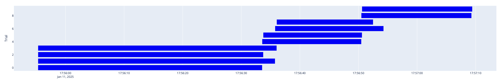

# Fully Parallelized Wrapper Around Optuna Using Flyte

## Overview

This documentation provides a guide to a fully parallelized Flyte plugin for Optuna. This wrapper leverages Flyte's scalable and distributed workflow orchestration capabilities to parallelize Optuna's hyperparameter optimization across multiple trials efficiently.




## Features

- **Ease of Use**: This plugin requires no external data storage or experiment tracking.
- **Parallelized Trial Execution**: Enables concurrent execution of Optuna trials, dramatically speeding up optimization tasks.
- **Scalability**: Leverages Flyte’s ability to scale horizontally to handle large-scale hyperparameter tuning jobs.
- **Flexible Integration**: Compatible with various machine learning frameworks and training pipelines.

## Installation

- Install `flytekit`
- Install `flytekitplugins.optuna`

## Getting Started

### Prerequisites

- A Flyte deployment configured and running.
- Python 3.9 or later.
- Familiarity with Flyte and asynchronous programming.

### Define the Objective Function

The objective function defines the problem to be optimized. It should include the hyperparameters to be tuned and return a value to minimize or maximize.

```python
import math

import flytekit as fl

image = fl.ImageSpec(packages=["flytekitplugins.optuna"])

@fl.task(container_image=image)
async def objective(x: float, y: int, z: int, power: int) -> float:
    return math.log((((x - 5) ** 2) + (y + 4) ** 4 + (3 * z - 3) ** 2)) ** power

```

### Configure the Flyte Workflow

The Flyte workflow orchestrates the parallel execution of Optuna trials. Below is an example:

```python
import flytekit as fl
from flytekitplugins.optuna import Optimizer, suggest

@fl.eager(container_image=image)
async def train(concurrency: int, n_trials: int) -> float:

    optimizer = Optimizer(objective=objective, concurrency=concurrency, n_trials=n_trials)

    await optimizer(
        x=suggest.float(low=-10, high=10),
        y=suggest.integer(low=-10, high=10),
        z=suggest.category([-5, 0, 3, 6, 9]),
        power=2,
    )

    print(optimizer.study.best_value)

```

### Register and Execute the Workflow

Submit the workflow to Flyte for execution:

```bash
pyflyte register files .
pyflyte run --name train
```

### Monitor Progress

You can monitor the progress of the trials via the Flyte Console. Each trial runs as a separate task, and the results are aggregated by the Optuna wrapper.

You may access the `optuna.Study` like so: `optimizer.study`.

Therefore, with `plotly` installed, you may create create Flyte Decks of the study like so:

```python
import plotly

fig = optuna.visualization.plot_timeline(optimizer.study)
fl.Deck(name, plotly.io.to_html(fig))
```

## Advanced Configuration

### Custom Dictionary Inputs

Suggestions may be defined in recursive dictionaries:

```python
import flytekit as fl
from flytekitplugins.optuna import Optimizer, suggest

image = fl.ImageSpec(packages=["flytekitplugins.optuna"])


@fl.task(container_image=image)
async def objective(params: dict[str, int | float | str]) -> float:
    ...


@fl.eager(container_image=image)
async def train(concurrency: int, n_trials: int):

    study = optuna.create_study(direction="maximize")

    optimizer = Optimizer(objective=objective, concurrency=concurrency, n_trials=n_trials, study=study)

    params = {
        "lambda": suggest.float(1e-8, 1.0, log=True),
        "alpha": suggest.float(1e-8, 1.0, log=True),
        "subsample": suggest.float(0.2, 1.0),
        "colsample_bytree": suggest.float(0.2, 1.0),
        "max_depth": suggest.integer(3, 9, step=2),
        "objective": "binary:logistic",
        "tree_method": "exact",
        "booster": "dart",
    }

    await optimizer(params=params)
```

### Custom Callbacks

In some cases, you may need to define the suggestions programmatically. This may be done

```python
import flytekit as fl
import optuna
from flytekitplugins.optuna import optimize

image = fl.ImageSpec(packages=["flytekitplugins.optuna"])

@fl.task(container_image=image)
async def objective(params: dict[str, int | float | str]) -> float:
    ...

@optimize
def optimizer(trial: optuna.Trial, verbosity: int, tree_method: str):

    params = {
        "verbosity:": verbosity,
        "tree_method": tree_method,
        "objective": "binary:logistic",
        # defines booster, gblinear for linear functions.
        "booster": trial.suggest_categorical("booster", ["gbtree", "gblinear", "dart"]),
        # sampling according to each tree.
        "colsample_bytree": trial.suggest_float("colsample_bytree", 0.2, 1.0),
    }

    if params["booster"] in ["gbtree", "dart"]:
        # maximum depth of the tree, signifies complexity of the tree.
        params["max_depth"] = trial.suggest_int("max_depth", 3, 9, step=2)

    if params["booster"] == "dart":
        params["sample_type"] = trial.suggest_categorical("sample_type", ["uniform", "weighted"])
        params["normalize_type"] = trial.suggest_categorical("normalize_type", ["tree", "forest"])

    return objective(params)


@fl.eager(container_image=image)
async def train(concurrency: int, n_trials: int):

    optimizer.concurrency = concurrency
    optimizer.n_trials = n_trials

    study = optuna.create_study(direction="maximize")

    await optimizer(verbosity=0, tree_method="exact")
```

## Troubleshooting

Resource Constraints: Ensure sufficient compute resources are allocated for the number of parallel jobs specified.

Flyte Errors: Refer to the Flyte logs and documentation to debug workflow execution issues.
