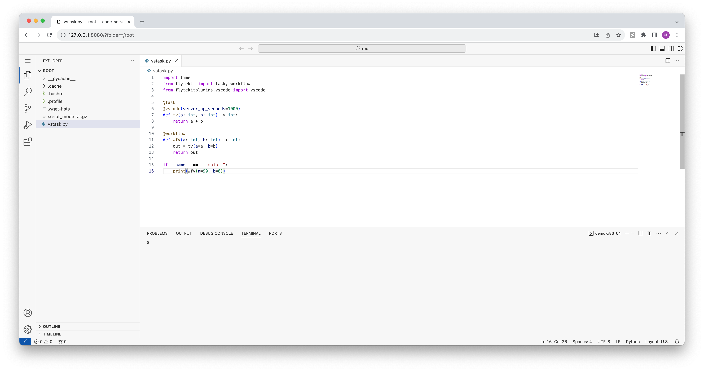

# Flytekit VSCode Plugin

The Flytekit VSCode plugin offers an easy solution for users to run Python tasks within an interactive VSCode server, compatible with any image. `@vscode` is a decorator which users can put within @task and user function. With `@vscode`, the task will install vscode dependencies (skip if they already exist) and run a vscode server instead of the user defined functions.

To install the plugin, run the following command:

```bash
pip install flytekitplugins-vscode
```

## Task Example
```python
from flytekit import task
from flytekitplugins.vscode import vscode

@task
@vscode
def train():
    ...
```

## User Guide
1. Build the image with Dockerfile.dev `docker build --push . -f Dockerfile.dev -t localhost:30000/flytekit:dev --build-arg PYTHON_VERSION=3.8`
2. Run the decorated task on the remote. For example: `pyflyte run --remote --image localhost:30000/flytekit:dev [PYTHONFILE] [WORKFLOW|TASK] [ARGS]...`
3. Once the code server is prepared, you can forward a local port to the pod. For example: `kubectl port-forward -n [NAMESPACE] [PODNAME] 8080:8080`.
4. You can access the server by opening a web browser and navigating to `localhost:8080`.

VSCode example screenshot:


## Build Custom Image with VSCode Plugin
If users want to skip the vscode downloading process at runtime, they have the option to create a custom image with vscode by including the following lines in their Dockerfile.
```Dockerfile
# Include this line if the image does not already have 'curl' installed.
+ RUN apt-get -y install curl
# Download and extract the binary, and ensure it's added to the system's $PATH.
+ RUN mkdir /tmp/code-server
+ RUN curl -kfL -o /tmp/code-server/code-server-4.18.0-linux-amd64.tar.gz https://github.com/coder/code-server/releases/download/v4.18.0/code-server-4.18.0-linux-amd64.tar.gz
+ RUN tar -xzf /tmp/code-server/code-server-4.18.0-linux-amd64.tar.gz -C /tmp/code-server/
+ ENV PATH="/tmp/code-server/code-server-4.18.0-linux-amd64/bin:${PATH}"
```
